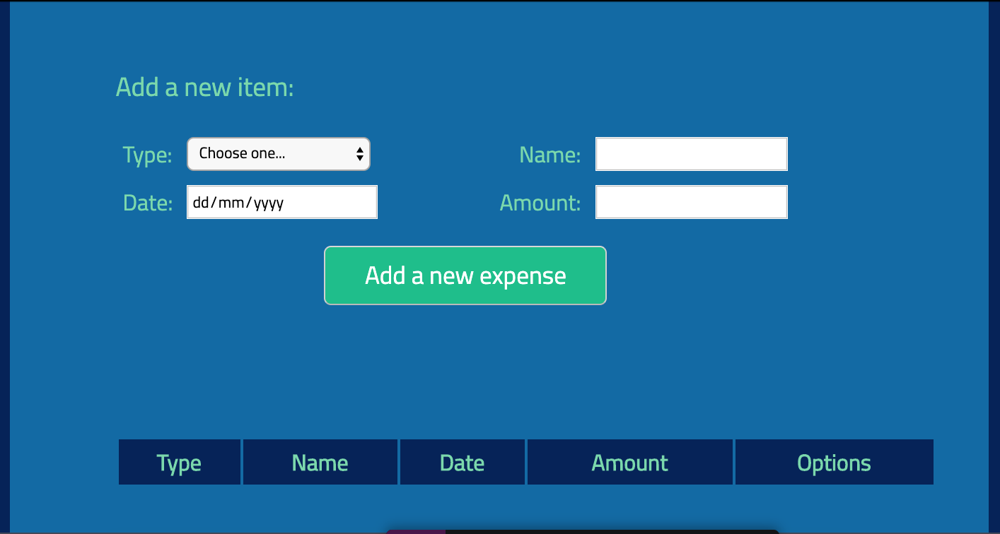

# Expense Tracker App

_A Expense Tracker application using vanilla javascript._

View live on CodePen <a href="https://marialobillo.github.io/expense-tracker-js/" target="_blank">HERE</a>.

 

## Summary

Expense Tracker is a single page application (SPA) to manage finances. The main objective of this application is to serve as a learning tool and to get into the Javascript programming language, learn to manage the DOM and its attributes. 

